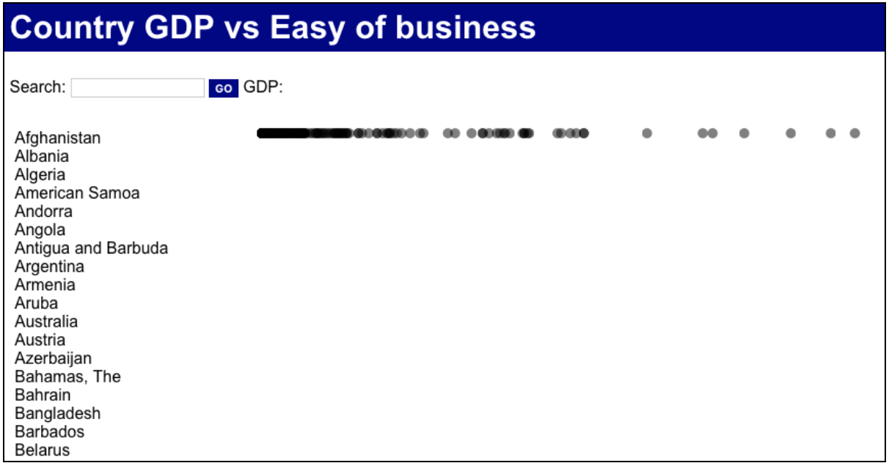

# Lab 3
-----------------------------------------------
For this assignment you have to update the page created in the [Lab 2](https://github.com/jaympatel/InformationVisualization/tree/master/LAB2) to show a list of the countries in the dataset and a simple visualization where each country is represented by a circle with radius 5px, the position of the circle on the x-axis should be proportional to the 'GDP per Capita' of the country. The visualization should have width equals to 600px.

The result should look like:




The page should load the data from The CSV file located at: [data.csv](https://github.com/jaympatel/InformationVisualization/blob/master/LAB3/data.csv)

=> SUBMIT one single HTML file named lastname_firstname_3.html. All your code (HTML, CSS and Javascript) should be within this single file.

Hints:

- Make sure that the functions to draw the list and the visualization only are called after the data is loaded. A good place to call these functions is after the sort operation of the previous assignment.
- Use a linear scale (d3.scale.linear()) to map the range of the pixels to the domain of the GDP per Capita

The d3 library has to be imported using the following tag: 
```html
<script src="https://cdnjs.cloudflare.com/ajax/libs/d3/3.5.6/d3.min.js" charset="utf-8"></script>
```

To see data on HTML do following:

- Put data.csv and patel_jay_3.html file in the same folder
- Run following command in the terminal in the same path: python -m SimpleHTTPServer
