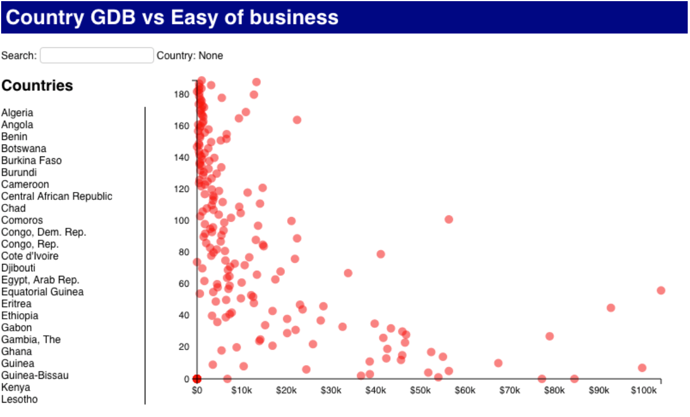

# Lab 4
-----------------------------------------------
For this assignment you have to update the page created in the [Lab 3](https://github.com/jaympatel/InformationVisualization/tree/master/LAB3) to show a scatterplot.

You have to add the Easy of Business to your data and map this attribute to the Y position of the dot.

The result should look like:

The page should load the data from The CSV file located at: [data.csv](https://github.com/jaympatel/InformationVisualization/blob/master/LAB4/data.csv)

=> **SUBMIT** one single HTML file named lastname_firstname_4.html. All your code (HTML, CSS and Javascript) should be within this single file.

To see data on HTML do following:

- Put data.csv and patel_jay_3.html file in the same folder
- Run following command in the terminal in the same path: python -m SimpleHTTPServer
