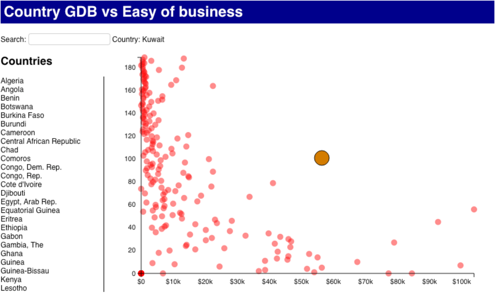

# Lab 6

For this assignment you have to update the page created in the [Lab 5](https://github.com/jaympatel/InformationVisualization/tree/master/LAB5) to support interaction between the List and the Scatterplot.

The user has to be able to:

- Filter the countries
- Remove a country 
- Select a country and see the GDP
- Highlight a country and see the tooltip

The result should look like:

The page should load the data from The CSV file located at: [data.csv](https://github.com/jaympatel/InformationVisualization/blob/master/LAB6/data.csv)

=> **SUBMIT** one single HTML file named lastname_firstname_5.html. All your code (HTML, CSS and Javascript) should be within this single file.

To see data on HTML do following:

- Put data.csv and patel_jay_5.html file in the same folder
- Run following command in the terminal in the same path: python -m SimpleHTTPServer
